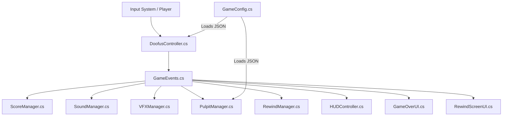

# ⛄ DOOFUS ADVENTURE — 50 Shades of Green

> **A polished, high-juice 3D arcade platformer built in Unity 6 (6000.5.7f1) with URP, featuring dynamic adjacent platform spawning, procedural character animation, a 360° Character Studio, Prince of Persia Time-Rewind mechanics, and authentic retro VHS VFX.**

---

## 🎮 Game Overview & Core Objective
Control **Doofus**, a lovable procedural snowman, as he navigates an endlessly shifting abyss of dissolving platforms (pulpits). 
- Every platform lasts only **5 seconds** before shattering into 3D physics debris!
- New platforms spawn adjacent to your current platform with forward-biased procedural random walks.
- Reach **50 pulpits** to claim victory, or use your **Sand of Time Rewind** charges to reverse fatal falls!

---

## 🕹️ Controls & Keybindings

| Action | Primary Key | Secondary Key | Description |
| :--- | :--- | :--- | :--- |
| **Move** | `W` `A` `S` `D` | `Arrow Keys` | Move Doofus with smooth acceleration & procedural lean |
| **Heroic Dash** | `Left Shift` | `Right Shift` | $3.2\times$ burst dash with exaggerated head lag ($0.65\text{m}$) & spring recovery |
| **Start / Resume** | `Space` | `Enter` / Click | Launch game from lobby or resume time-rewind touchdown |
| **Quick Retry** | `R` | `Space` / Click | Instantly restart a fresh run from Game Over |
| **Color Customizer** | `Mouse Click & Drag` | — | Interactive 360° Circular HSV Color Wheel in the Lobby |

---

## 🏗️ Architecture & Engineering Design

The codebase strictly follows **SOLID principles** and **Event-Driven Decoupled Architecture**:



### Key Modules:
- **`GameEvents.cs`**: Decoupled static event hub. Zero tight spaghetti dependencies between UI, audio, VFX, and physics logic.
- **`PulpitManager.cs`**: Platform lifecycle engine. Enforces max 2 active platforms, anti-backtracking history, adjacent spatial math, and deterministic timeline caching.
- **`DoofusController.cs` & `DoofusAnimator.cs`**: Physics locomotion, Shift Dash burst curve, procedural body lean ($22^\circ / 38^\circ$), head bobbing, wide wind-speed eyes, 3-phase high-visibility blinking, and stopping brake whip.
- **`RewindManager.cs`**: Prince of Persia Time Rewind engine. Deterministic WorldTime buffer ($0.12\times$ slow-mo fall dilation $\to$ dynamic $3.2\times$ time reversal $\to$ player-directed WASD resume).
- **`PlatformShatterFX.cs`**: Dynamic 3D physics fracture generator (9–13 procedural shards per platform) with reverse mid-air reassembly during rewind.
- **`SoundManager.cs`**: Dual-mode audio engine supporting custom Inspector audio clips with procedural 44.1kHz wave synthesis fallbacks and dynamic rewind tape-pitch warping.
- **`CustomizationManager.cs` & `ColorWheelPicker.cs`**: True 360° circular HSV color wheel texture generator ($H = \text{atan2}(y, x), S = r/R$) with real-time 3D Doofus turntable preview and `PlayerPrefs` hex persistence.
- **`RewindScreenUI.cs`**: Full-screen VHS retro glitch engine (rolling CRT scanlines, edge-to-edge RGB chromatic glitch strips, VCR tracking noise bar, and URP Chromatic Aberration).

---

## ⚙️ Configuration (`StreamingAssets/game_data.json`)

The game loads all core tuning parameters dynamically from external JSON at startup:

```json
{
  "player_data": {
    "speed": 3
  },
  "pulpit_data": {
    "min_pulpit_destroy_time": 5,
    "max_pulpit_destroy_time": 5,
    "pulpit_spawn_time": 2.5
  }
}
```

- If `game_data.json` is modified or missing, [`GameConfig.cs`](file:///d:/Antigravity%20Projects/50%20Shades%20of%20Green/DoofusAdventure/Assets/_Game/Scripts/Core/GameConfig.cs) catches the exception and gracefully applies safe defaults without crashing.

---

## 🏆 Levels & Evaluation Matrix Compliance

| Requirement / Feature | Implementation Details | Status |
| :--- | :--- | :---: |
| **Level 1: Core Mechanics** | Dynamic pulpit spawning, 5s countdown lifecycle, color shift (Green $\to$ Yellow $\to$ Red), max 2 active platforms, player physics movement, JSON config loader. | ✅ **100% Complete** |
| **Level 2: Animation & Polish** | Procedural snowman lean & head lag, stopping brake whip, wide panic eyes, isometric camera follow with screen shake, high score persistence. | ✅ **100% Complete** |
| **Level 3: Game Flow & UI** | Start Screen Studio, Chunky Arcade Marquee HUD (`SCORE : X`, `BEST : Y`), Rewind Charges Battery, Game Over screen with score ticker, 50-pulpit challenge banner, instant retry. | ✅ **100% Complete** |
| **Extra: Prince of Persia Rewind** | Deterministic WorldTime buffer, slow-mo dilation, dynamic time-reversal curve, reverse puzzle platform reassembly, interactive WASD resume. | ✅ **100% Complete** |
| **Extra: 3D Shatter FX** | Procedural 3D organic shards crumbling into the abyss and reverse-reassembling mid-air. | ✅ **100% Complete** |
| **Extra: Character Studio** | 360° Circular HSV Color Wheel for Body, Head, and Eyes with live 3D preview and PlayerPrefs persistence. | ✅ **100% Complete** |
| **Extra: Heroic Shift Dash** | $3.2\times$ burst on Shift with exaggerated $0.65\text{m}$ head drag backward and spring recovery. | ✅ **100% Complete** |
| **Extra: Audio & VFX Suite** | Alternating boop footsteps (muted during dash), BGM pitch warping, outward downside tile placement dust, VHS RGB glitch overlay. | ✅ **100% Complete** |

---

## 🛠️ Build & Run Instructions

### In Unity Editor:
1. Open the project in **Unity 6 (6000.5.7f1)** with Universal Render Pipeline (URP).
2. Open scene: `Assets/Scenes/SampleScene.unity`.
3. Press **Play** ▶!

### Standalone Windows Build:
1. Go to **File ➔ Build Profiles** (or **Build Settings**).
2. Ensure `Assets/Scenes/SampleScene.unity` is included in Scenes In Build.
3. Target Platform: **Windows, Mac, Linux** ➔ Architecture: **x86_64**.
4. Click **Build and Run** ➔ Select destination folder (e.g., `Builds/DoofusAdventure.exe`).
