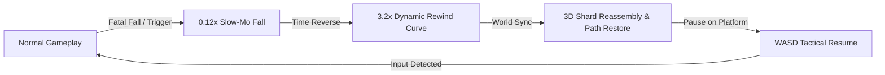
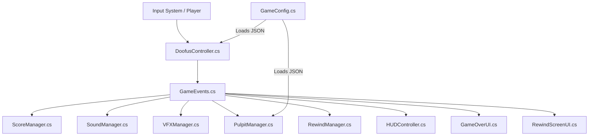

# ⛄ DOOFUS ADVENTURE — 50 Shades of Green

[](https://unity.com/)
[](https://unity.com/srp/universal-render-pipeline)
[](https://github.com/Dishu223/HW_2026_Test)
[](https://github.com/Dishu223/HW_2026_Test)

> **A high-juice 3D arcade platformer built in Unity 6 (URP) featuring dynamic adjacent platform spawning, procedural snowman animations, a 360° Character Customizer, and a full *Prince of Persia: Warrior Within*-inspired Time-Rewind System.**

---

## 📸 Visual Showcase & Previews

| In-Game Action & Platform Lifecycles | 360° Circular HSV Character Studio |
| :---: | :---: |
|  |  |
| *Active pulpit countdowns, Character dashing, score tracker & rewind charges* | *Live 360° HSV color wheel & 3D character customization* |

| Start Screen & Lobby UI | Game Over & Time Rewind Overlay |
| :---: | :---: |
|  |  |
| *Arcade lobby with custom character preview* | *Unity Editor view* |

### 🎥 Full Gameplay & Rewind Video Demonstration

<div align="center">

> 🎬 **Watch the full gameplay and rewind system in action**:

<a href="https://www.youtube.com/watch?v=hgogVKnqOVE">
  
</a>

</div>

## 📖 Table of Contents
- [🎮 Game Overview](#-game-overview)
- [⏳ Spotlight: Prince of Persia Time-Rewind System](#-spotlight-prince-of-persia-time-rewind-system)
- [💡 Engineering Journey & Challenges Overcome](#-engineering-journey--challenges-overcome)
- [🕹️ Controls & Keybindings](#️-controls--keybindings)
- [✨ Core Features & Mechanics](#-core-features--mechanics)
- [🏗️ Architecture & Engineering](#️-architecture--engineering)
- [⚙️ JSON Configuration](#️-json-configuration)
- [🏆 Evaluation Matrix & Features](#-evaluation-matrix--features)
- [🛠️ Build & Run Instructions](#️-build--run-instructions)
- [🔗 Repository Link](#-repository-link)

---

## 🎮 Game Overview

Take control of **Doofus**, a lovable procedural snowman, as he runs across an endlessly shifting abyss of dissolving platforms called **Pulpits**:

- ⏱️ **5-Second Platform Lifespan**: Every pulpit counts down from green to yellow to red before shattering into the void.
- 🎲 **Procedural Adjacent Spawning**: Platforms spawn in real-time right beside your current platform with forward-biased random walks.
- 🏁 **The 50-Pulpit Challenge**: Traverse 50 pulpits without falling to achieve victory!
- ⏳ **Rewind Charges**: Fatal fall? Reverse time and try the jump again!

---

## ⏳ Spotlight: Prince of Persia Time-Rewind System

### 🗡️ The Childhood Inspiration
Growing up, one of my absolute favorite games was **_Prince of Persia: Warrior Within_**. That iconic mechanic—where slipping into an abyss or mistiming a deadly jump wasn't an immediate game over, but an opportunity to unleash the **Sands of Time** and reverse reality—left a lasting impression on me.

For **Doofus Adventure**, I recreated that magical experience from scratch in Unity 6!



---

### 🧠 How It Works Under the Hood (Simple & Intuitive)

The rewind system is engineered across five synchronized layers to make time reversal feel seamless, responsive, and cinematic:

#### 1. 📜 Continuous History Ring Buffer (The Sandglass)
During normal gameplay, [`RewindManager.cs`](file:///d:/Antigravity%20Projects/50%20Shades%20of%20Green/DoofusAdventure/Assets/_Game/Scripts/Core/RewindManager.cs) records Doofus’s exact **position, rotation, and timestamp** on every physics step (`FixedUpdate`) into a high-performance `LinkedList<PlayerSnapshot>`. It stores up to 3.5 seconds of historical snapshots while automatically pruning older frames to keep memory overhead near zero.

#### 2. 🎬 Phase 1: Dramatic Slow-Motion Fall ($0.12\times$)
The moment a fatal fall is detected, time slows down to **$0.12\times$ speed** for 0.50 seconds in real-time. This mirrors the heart-stopping cinematic suspense of *Warrior Within*, giving you that punchy moment of tension before the time reversal takes over.

#### 3. ⏪ Phase 2: Dynamic Non-Linear Rewind Curve ($3.2\times$)
Rather than playing history back at a flat speed, the reversal follows an acceleration curve:
- **Ease-In ($0.35\times \to 3.2\times$)**: Starts smoothly as Doofus begins rising from the abyss.
- **High-Speed Rush ($3.2\times$)**: Sprints backwards through the falling trajectory.
- **Ease-Out ($3.2\times \to 1.0\times$)**: Decelerates smoothly as Doofus lands back safely onto solid ground.

#### 4. 🧩 Phase 3: Mid-Air Shard Reassembly & Deterministic Path Memory
Time doesn't just reverse for Doofus—the entire world rewinds in unison:
- **3D Fracture Reassembly** ([`PlatformShatterFX.cs`](file:///d:/Antigravity%20Projects/50%20Shades%20of%20Green/DoofusAdventure/Assets/_Game/Scripts/Platform/PlatformShatterFX.cs)): Platforms that shattered into 9–13 physics debris pieces rewind their trajectories and organically snap back into place.
- **Deterministic Platform Layout** ([`PulpitManager.cs`](file:///d:/Antigravity%20Projects/50%20Shades%20of%20Green/DoofusAdventure/Assets/_Game/Scripts/Platform/PulpitManager.cs)): Platform coordinates are cached in a sequence history so that after rewinding, the exact same platform layout and timings are maintained without random desynchronization.

#### 5. 📺 Phase 4: Retro Glitch VFX, Tape-Warp Audio & WASD Resume
- **Authentic Retro Glitch** ([`RewindScreenUI.cs`](file:///d:/Antigravity%20Projects/50%20Shades%20of%20Green/DoofusAdventure/Assets/_Game/Scripts/UI/RewindScreenUI.cs)): Rolling CRT scanlines, RGB chromatic aberration, and VHS tracking noise play during the rush, instantly clearing when landing.
- **Pitch-Warped Audio** ([`SoundManager.cs`](file:///d:/Antigravity%20Projects/50%20Shades%20of%20Green/DoofusAdventure/Assets/_Game/Scripts/Core/SoundManager.cs)): Background music dynamically slows down and a tape-rewind whoosh plays in reverse.
- **Tactical Pause**: Once safely on the platform, the game pauses (`Time.timeScale = 0`) displaying `>> PRESS WASD OR SPACE TO RESUME <<`, giving the player full control over when to step back into action!

---

## 💡 Engineering Journey & Challenges Overcome

Building this project came with its fair share of interesting bugs, design puzzles, and even unexpected hardware hiccups! Here is an honest breakdown of the challenges encountered and how I solved them using **Google Search, YouTube breakdowns, Unity documentation, and AI pair-programming**:

### ⏳ 1. The Prince of Persia Time-Rewind System
- **The Challenge**: 
  - Making a rewind mechanic work cleanly in 3D physics is tricky. It's not just moving the character backward—physics momentum caused jitter, shattered platform debris got lost, and newly generated platforms would spawn in completely different spots after rewinding, breaking the player's run continuity.
- **How I Approached & Solved It**:
  - **Physics Freezing**: Cleared momentum and velocities safely before rewinding so the character moves cleanly without glitches.
  - **Debris Time Tracking**: Recorded position history for every shattered platform piece so they reverse-fly back together mid-air like puzzle pieces.
  - **Memory of Platform Paths**: Saved the layout history so that when you rewind, the game replays the exact same platform path and timers rather than generating new random directions.
  - **Cinematic Speed Curve**: Designed the rewind to start smooth, speed up into a dramatic rush, and gently slow down as you land back on solid ground.

---

### ⛄ 2. Procedural Snowman Animation & "Game Juice"
- **The Challenge**: 
  - A snowman made of simple spheres looked stiff, robotic, and boring when sliding across platforms.
  - Building a full animated skeleton in 3D software was too rigid and didn't react naturally to sudden gameplay dashes or turns.
- **How I Approached & Solved It**:
  - **Dynamic Leaning**: Made the body tilt naturally in the direction of movement, leaning even deeper when sprinting.
  - **Springy Head Lag**: Added a spring-like delay to the head so it trails behind during dashes and bounces back with satisfying momentum when stopping.
  - **Lively Micro-Expressions**: Added wide wind-speed eyes during sprints, natural blinking, and a sudden brake whip when releasing movement keys.
  - **YouTube & AI Synergy**: Studied classic game-juice principles (squash, stretch, anticipation) on YouTube and used AI to quickly dial in the spring physics.

---

### ☁️ 3. Cloud Generation, Skybox & Performance Optimization
- **The Challenge**: 
  - A flat blue sky felt empty, but adding heavy 3D clouds caused frame drops and lag, and poorly placed clouds blocked the camera view of the platforms.
- **How I Approached & Solved It**:
  - **Lightweight Cloud Clusters**: Created stylized fluffy cloud clusters around and below the play area using simple shapes to keep the atmosphere rich.
  - **Performance Optimization**: Turned off heavy shadows and unnecessary lighting on background clouds so the game stays silky smooth at high frame rates.
  - **Camera Framing**: Positioned the clouds so they add great depth without ever getting in the way of the player or the platform timers.

---

### 🎨 4. Interactive 360° Circular Color Wheel
- **The Challenge**: 
  - Standard RGB sliders felt clunky and boring for an arcade lobby.
  - Making a true circular color wheel natively in Unity without relying on bloated third-party plugins was tricky to map from 2D mouse clicks.
- **How I Approached & Solved It**:
  - **Circular Color Generator**: Researched color wheel math and generated a smooth 360° hue-saturation wheel on the fly.
  - **Live 3D Preview**: Connected mouse clicks directly to the snowman on a rotating turntable in the lobby, with custom colors automatically saved between runs.

---

### 📶 5. The Late-Night Panic: Wi-Fi Disappeared!
- **The Challenge**: 
  - Late at night in the middle of development, the Wi-Fi icon completely vanished from my laptop's taskbar due to a sudden driver glitch.
  - With no internet for lookups, documentation, and syncing commits, panic set in!
- **How I Approached & Solved It**:
  - **Stayed Calm & Found a Workaround**: Instead of wasting hours troubleshooting Windows drivers in the middle of a coding flow, I plugged my phone in via USB cable and enabled **USB Tethering**.
  - **Kept the Momentum Going**: Got instant internet access, continued building and testing without interruption, and sorted out the Wi-Fi driver later after the build was done!

---

### 🛠️ 6. My Problem-Solving Toolkit
- 🔍 **Google Search**: Looking up Unity engine features and math logic.
- 📺 **YouTube Game Dev Channels**: Studying game feel, screen shake, and animation principles.
- 🤖 **AI Pair-Programming**: Rapidly brainstorming ideas, refining math curves, and debugging edge cases.
- 🎮 **Rapid Playtesting**: Playing the game after every change to make sure the controls felt punchy, responsive, and fun.


---

## 🕹️ Controls & Keybindings

| Action | Primary Key | Secondary Key | Description |
| :--- | :--- | :--- | :--- |
| **Move** | `W` `A` `S` `D` | `Arrow Keys` | Move Doofus with smooth acceleration & procedural body lean |
| **Heroic Dash** | `Left Shift` | `Right Shift` | $3.2\times$ burst dash with exaggerated head lag ($0.65\text{m}$) & spring recovery |
| **Start / Resume** | `Space` | `Enter` / Click | Launch game from lobby or resume from rewind touchdown |
| **Quick Retry** | `R` | `Space` / Click | Instantly restart a fresh run from the Game Over screen |
| **Color Studio** | `Mouse Drag` | — | Interactive 360° Circular HSV Color Wheel in the Lobby |

---

## ✨ Core Features & Mechanics

### ⛄ Procedural Character Animation
- **Dynamic Lean**: Leans $22^\circ$ during normal runs and up to $38^\circ$ during high-speed dashes.
- **Head Lag & Spring Recovery**: Snowman head trails realistically behind the base when dashing and bounces back via spring physics.
- **Animated Expressions**: Wind-speed eye widening during sprints, 3-phase blinking, and sudden stopping brake whip.

### 🎨 360° Character Studio (HSV Color Picker)
- Live 360° circular hue-saturation color wheel generated via procedural math ($H = \text{atan2}(y, x), S = r/R$).
- Real-time 3D turntable preview for customizing Doofus’s **Body**, **Head**, and **Eyes**.
- Persistent custom skins saved automatically across sessions via `PlayerPrefs`.

### 💥 Procedural 3D Platform Shatter FX
- Organic platform fracture system creating 9 to 13 varied stone/tile shards per platform.
- Radial wave collapse where the center sinks and corner shards tumble outward into the abyss.
- Seamless reverse reassembly during time rewinds.

### 🎵 High-Juice Audio & Retro VFX Suite
- Alternating left/right footstep boops (muted during dash bursts).
- Procedural 44.1 kHz synthesizer audio fallbacks for all SFX.
- Full-screen VHS scanlines, VCR tracking noise bar, and URP Chromatic Aberration.

---

## 🏗️ Architecture & Engineering

The codebase is built on **SOLID principles** and an **Event-Driven Decoupled Architecture**:



### Module Breakdown:
- **`GameEvents.cs`**: Static event hub eliminating hard coupling between UI, Audio, VFX, and Gameplay systems.
- **`RewindManager.cs`**: Sands of Time rewind engine handling snapshot caching, slow-mo dilation, dynamic playback curves, and resume pauses.
- **`PulpitManager.cs`**: Platform lifecycle engine ensuring a maximum of 2 active platforms, anti-backtracking memory, and deterministic spatial path caching.
- **`DoofusController.cs` & `DoofusAnimator.cs`**: Physics locomotion, shift dashes, and procedural snowman animations.
- **`PlatformShatterFX.cs`**: 3D physics fragmentation and mid-air reassembly.
- **`SoundManager.cs`**: Multi-track music player with tape-pitch warping and procedural SFX generation.
- **`CustomizationManager.cs` & `ColorWheelPicker.cs`**: 360° HSV texture generator and turntable controller.

---

## ⚙️ JSON Configuration

Core balance parameters are loaded dynamically from `StreamingAssets/game_data.json` at startup:

```json
{
  "player_data": {
    "speed": 3
  },
  "pulpit_data": {
    "min_pulpit_destroy_time": 5,
    "max_pulpit_destroy_time": 5,
    "pulpit_spawn_time": 2.5
  }
}
```

- If `game_data.json` is missing or contains invalid syntax, [`GameConfig.cs`](file:///d:/Antigravity%20Projects/50%20Shades%20of%20Green/DoofusAdventure/Assets/_Game/Scripts/Core/GameConfig.cs) automatically catches the error and applies safe fallback defaults without crashing.

---

## 🏆 Evaluation Matrix & Features

| Requirement / Feature | Implementation Details | Status |
| :--- | :--- | :---: |
| **Level 1: Core Mechanics** | Dynamic pulpit spawning, 5s countdown lifecycle, color shift (Green $\to$ Yellow $\to$ Red), max 2 active platforms, player physics movement, JSON config loader. | ✅ **100% Complete** |
| **Level 2: Animation & Polish** | Procedural snowman lean & head lag, stopping brake whip, wide panic eyes, isometric camera follow with screen shake, high score persistence. | ✅ **100% Complete** |
| **Level 3: Game Flow & UI** | Start Screen Studio, Chunky Arcade Marquee HUD (`SCORE : X`, `BEST : Y`), Rewind Charges Battery, Game Over screen with score ticker, 50-pulpit challenge banner, instant retry. | ✅ **100% Complete** |
| **Extra: Prince of Persia Rewind** | Deterministic WorldTime buffer, $0.12\times$ slow-mo dilation, dynamic $3.2\times$ time-reversal curve, mid-air platform shard reassembly, interactive WASD resume. | ✅ **100% Complete** |
| **Extra: 3D Shatter FX** | Procedural 3D organic shards crumbling into the abyss with reverse-physics reassembly. | ✅ **100% Complete** |
| **Extra: Character Studio** | 360° Circular HSV Color Wheel for Body, Head, and Eyes with live 3D preview and PlayerPrefs persistence. | ✅ **100% Complete** |
| **Extra: Heroic Shift Dash** | $3.2\times$ burst on Shift with exaggerated $0.65\text{m}$ head drag backward and spring recovery. | ✅ **100% Complete** |
| **Extra: Audio & VFX Suite** | Alternating boop footsteps, BGM pitch warping, outward tile placement dust, VHS RGB glitch overlay. | ✅ **100% Complete** |

---

## 🛠️ Build & Run Instructions

### In Unity Editor:
1. Open the project in **Unity 6 (6000.5.7f1)** with Universal Render Pipeline (URP).
2. Open scene: `Assets/Scenes/SampleScene.unity`.
3. Press **Play** ▶!

### Standalone Windows Build:
1. In Unity, go to **File ➔ Build Profiles** (or **Build Settings**).
2. Ensure `Assets/Scenes/SampleScene.unity` is listed in **Scenes In Build**.
3. Select Target Platform: **Windows, Mac, Linux** ➔ Architecture: **x86_64**.
4. Click **Build and Run** ➔ Choose destination folder (e.g., `Builds/DoofusAdventure.exe`).

---

## 🔗 Repository Link

- **GitHub Repository**: [https://github.com/Dishu223/HW_2026_Test](https://github.com/Dishu223/HW_2026_Test)

---

*Crafted with my love for gaming and game development!.*
